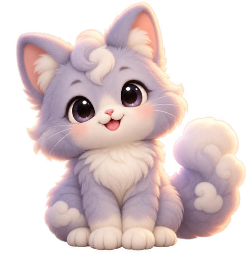
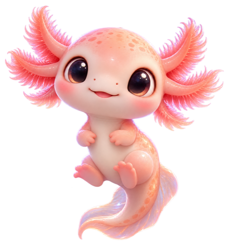
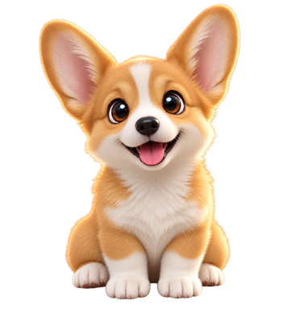

<h1 align="center">DSH Pet Companion · DSH 萌宠伴侣</h1>

<p align="center">Sixteen tiny companions to make long agent runs feel a little warmer.</p>

<p align="center">
  <a href="https://www.npmjs.com/package/@tobewin/dsh-pet-companion"></a>
  <a href="LICENSE"></a>
  
  
</p>

<p align="center"><a href="#quick-start--快速开始">Quick start</a> · <a href="#features--功能">功能</a> · <a href="https://github.com/ToBeWin/DSH-Plugin-Market">All ToBeWin plugins</a></p>

An animated, local-only desktop pet for [DeepSeek Harness](https://github.com/deepseek-ai/deepseek-harness).

为 DeepSeek Harness 提供一个可爱的动态桌面萌宠。所有设置只保存在当前浏览器，本插件只使用公开的 Settings、Locale 和 UI Primitives 接口，不修改或依赖 Harness 源码。

## Meet the companions / 认识萌宠

<p align="center">
  
  &nbsp;&nbsp;
  
  &nbsp;&nbsp;
  
  &nbsp;&nbsp;
  
</p>

<p align="center"><strong>Beaver · Cloud Cat · Axolotl · Corgi</strong><br>Plus twelve more local characters, each with motion and bilingual greetings.<br>另有 12 个本地角色，每个角色都带有动态效果和中英文问候语。</p>

## Features / 功能

- Sixteen original, high-resolution mascot templates: beaver, cats, dogs, rabbit, hamster, otter, penguins, foxes, red panda, panda, koala, duckling, and raccoon.
- Gentle floating, breathing, and ambient-light motion; reduced-motion preferences are respected.
- Hover over or click the pet for a short, random greeting; greetings follow the Harness Chinese/English locale.
- Select a pet, dock it left or right, choose its size, pause animation, or hide/show it.
- A quick hide button appears beside the pet; all controls are available in the dedicated Pet Companion settings section.
- Automatically follows DeepSeek Harness light/dark theme and Chinese/English settings.

## Quick start / 快速开始

```bash
dsh plugin --profile web add @tobewin/dsh-pet-companion
```

Install it through DeepSeek Harness Plugin Market, then restart Harness if prompted. Open **Settings → Pet Companion** to configure it.

通过 DeepSeek Harness 的插件市场安装，按提示重启后，在 **设置 → 萌宠伴侣** 中配置。

## Development / 开发

```bash
pnpm install
pnpm check
pnpm build
```

## Compatibility and privacy / 兼容性与隐私

The pet is a plugin-owned, non-interactive floating layer. Original mascot artwork is packaged locally with the plugin; no external asset URLs are used. The layer is attached and removed by this plugin alone and does not query private Harness DOM or patch official files. Preferences use `localStorage` only; no network requests or telemetry are made.

萌宠是插件自有的非交互悬浮层；原创角色素材随插件本地打包，不使用外部图片链接。它由插件自行创建和销毁，不会查询 Harness 私有 DOM，也不会修改官方文件。配置仅存于本地 `localStorage`，不发送网络请求或遥测数据。
